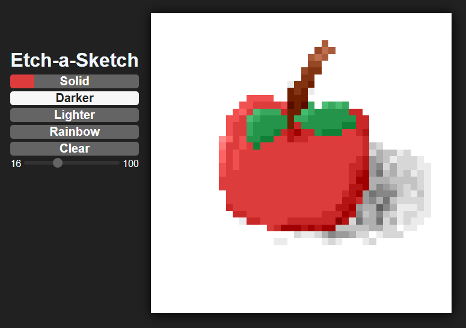

# Etch-a-Sketch

Following [The Odin Project](https://www.theodinproject.com/).

An interactive web application that implements a classic mouse-controlled drawing toy.

## Functionality

- Draw on the grid by hover the cursor over the pixels.
- A selection of drawing tools that allow you to paint any color, darken pixels, lighten pixels, paint with random bright colors (rainbow)
- Ability to clear the canvas.



## Some code

```javascript
gridElement.addEventListener("mouseover", () => {
  if (canDraw) {
    gridElement.style.background = "black";
  }
});
```

```javascript
buttons.forEach((button) =>
  button.addEventListener("click", () => {
    colorTool = button.textContent;
  })
);
```

```javascript
const currentColor = element.style.background
  .replace("rgb(", "")
  .replace(")", "")
  .split(", ");

let newColor = [];

currentColor.forEach((color) => newColor.push(+color + 20));

return `rgb(${newColor[0]}, ${newColor[1]}, ${newColor[2]})`;
```
